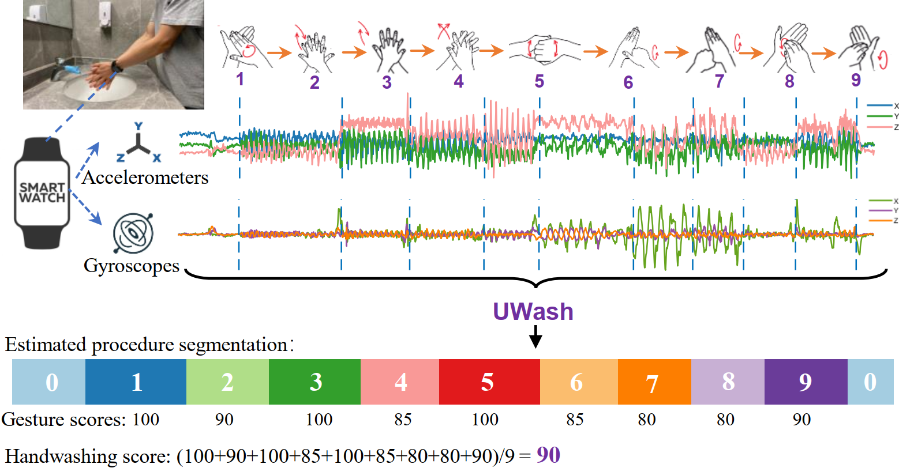

# UWash 👋

  

**UWash** is a smartwatch-based handwashing assessment appraoch. UWash can score the handwashing quality for the purpose of guiding users to improve their handwashing techniques arrording to the [WHO guidelines](https://www.who.int/publications/m/item/hand-hygiene-why-how-when). UWash aims to raise users' awareness and cultivating habits of high-quality handwashing

For more details on UWash, refer to our paper: [**"You Can Wash Hands Better: Accurate Daily
Handwashing Assessment with Smartwatches"**](http://arxiv.org/abs/2112.06657)

## Dataset 📊

The dataset used for UWash is essential for training and evaluating the detection models. It includes both the raw and preprocessed data.

Raw Dataset: [**Dataset_raw.zip**](https://drive.google.com/file/d/1ZRdRiwXp4xbFUWIIjIQ0OEK6gK0cwODN/view?usp=sharing)

## Setup & Running 🛠️
Follow these steps to set up and run:

1. Clone Repository

`git clone git@github.com:aiotgroup/UWash.git`

`cd UWash`

2. preprocess dataset 

the sequence of preprocess raw data(unprocess IMU data and correspond time-series label) to train and test dataset as follow:
 
./pre_validation/decode_sensor_data.py -> ./pre_validation/shift_data.py -> ./pre_validation/augment_data.py

**BUT FIRST: you need modify above files' parameter: base_path to fit you raw dataset file's location**

3. train and evaluation

all train and test strategy is in ./UWasher/train_eval

**ALSO FIRST THING FIRST: you need modify ./UWasher/data/DatasetConfig.py to redirect you preprocessed-dataset file location**

* normal-strategy: 
  * train-script: normal_64.py(as segment length equals 64), normal_128.py(as segment length equals 128)
  * eval-script: nomrmal_eval_64.py, normal_eval_128.py
* location-independent:
  * train-script: li_64.py
  * eval-script: li_eval_64.py
* user-independent:
  * train-script: ui_64.py
  * eval-script: ui_eval_64.py

## Contacts Us ✉️
For any queries, you are welcome to open an issue.

## License 📜
UWash is licensed under the MIT License. See the LICENSE file for more details.

## 
